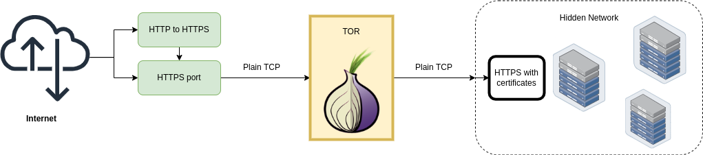

socks5-reverse-proxy-role
=========================



Ansible role for setting up a reverse TCP proxy to expose a service behind a socks5 (e.g. a TOR hidden service to "clear net").

The proxy passes data as-it-is, the TCP stream is not parsed nor modified.

TLS termination (if any) does not change.


HTTP to HTTPS redirect
----------------------

In order to setup a HTTP to HTTPS redirect, set `webserver_enabled: true`.

```yaml
webserver_enabled: false
caddy_version: 2.5.2
```
